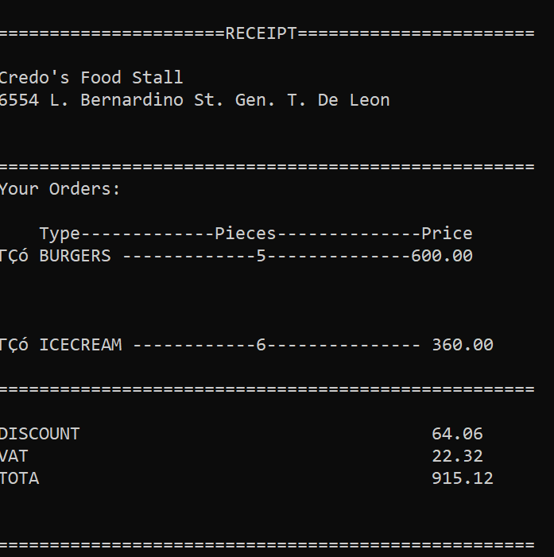

# Food Stall Billing System

### Intro
Welcome to my messy but functional code! 
(Yes, it might look chaotic, but don’t worry—it does the job. At the end, the pizza still gets served.)  

This is a simple C program that records and prints a receipt. It’s designed for one-time use only since no file handling involved.

---

## What the Program is About

### 1. Choose Your Food, Shows the Amount, & Gives Options  
The program displays a menu of food items (Burger, Fries, Soda, Pizza, Ice cream). The user selects an item and inputs how many they want. After selection, the program calculates the price and asks if you want to:  
- **Add to Cart (0)** → go back to menu  
- **Proceed to Orders (1)** → move forward with checkout  


---

### 2. Add to Cart → Back to Menu  
If you choose to add to cart, it saves the current item and returns you to the food menu to pick more.  


---

### 3. Proceed to Orders  
When you proceed, the program finalizes your orders and shows the current cart total. If your total qualifies, it even unlocks discount vouchers  


---

### 4. Voucher Selection  
Depending on your cart amount, vouchers appear (e.g., `GASTOSMOTOL`, `PANTROPA`, `YAMAN`). The program applies the discount and adds VAT.  


---

### 5. Final Price  
After discounts and tax, the program presents your final payable amount.  


---

### 6. Receipt Generation  
Finally, you can choose to print a detailed receipt with shop info, item breakdown, discounts, VAT, and total.  


---

## How to Run
1. Copy the code into a file named `tusoktusok.c`  
2. Compile with:  
   ```bash
   gcc receipt.c -o receipt

---

## Diagram

[Choose Food] → [Show Price] → [Add to Cart or Proceed?]
                   |                  |
                   ↓                  ↓
              [Back to Menu]     [Show Cart + Vouchers] → [Final Price] → [Receipt]
---


